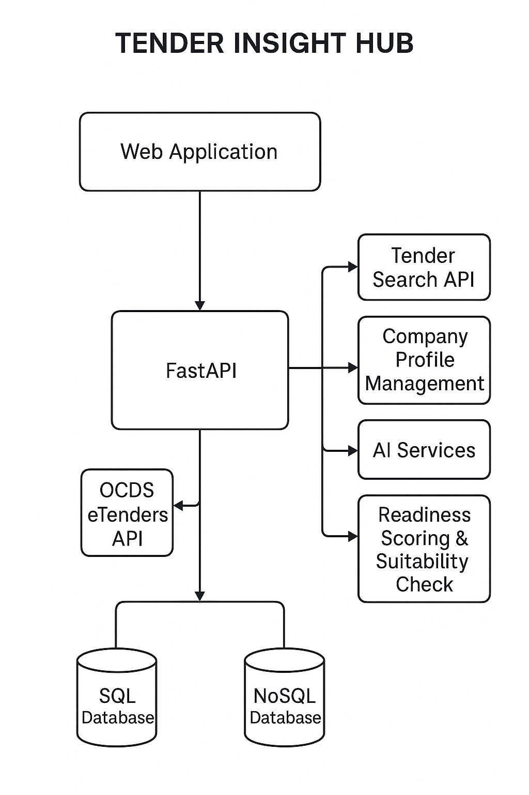

# System Design

## Architecture Diagram

## Technologies Used
- FastAPI (Backend)
- PostgreSQL / MySQL (SQL Database)
- MongoDB / Redis (NoSQL Database)
- JWT Authentication
- GitHub Actions (CI/CD)

## High-Level Design
The Tender Insight Hub architecture follows a multi-tier structure with five main layers:

Frontend (Presentation Layer):

Built to, it allows users to search, filter, and view readiness results.

Backend (Application Layer):

Developed using FastAPI.

Handles authentication, tender search, AI summarization, readiness scoring, and workspace management.

Databases (Data Layer):

SQL : Stores structured data like users, profiles, and tenders.

NoSQL : Stores AI summaries, readiness results, and logs.

External Integration Layer:

Connects to the OCDS eTenders API for tender data and to AI models  for document summarization.

Infrastructure Layer:

Includes GitHub for version control
