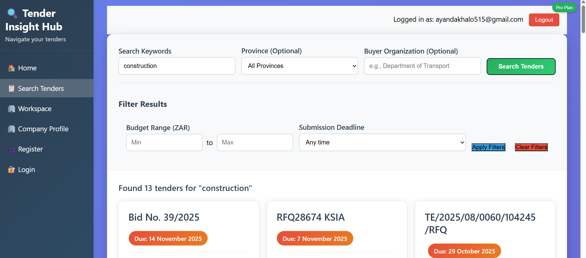
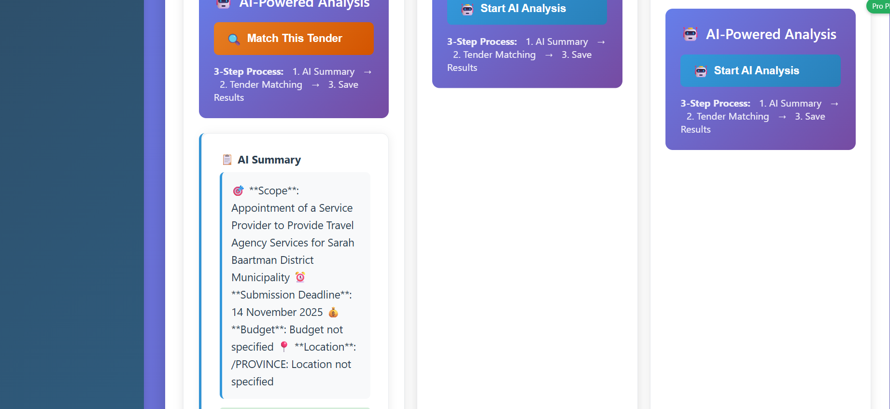
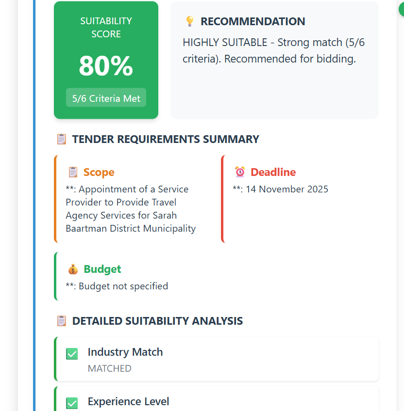
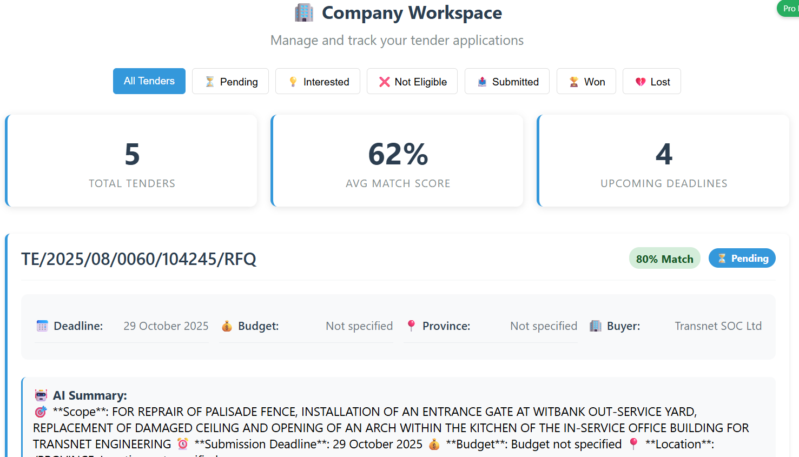

# 🌍 Tender Insight Hub

**Tender Insight Hub** is a cloud-native SaaS platform that helps South African SMEs navigate public procurement opportunities.  
It simplifies tender documents, enables analysis, and helps companies assess their readiness to apply for tenders.  
The system supports team collaboration, AI-assisted insights, and multi-tier SaaS access.

---

## 🔗 Project Overview
- Built with **FastAPI (Python)** for a modern, high-performance backend.  
- Uses **SQL (PostgreSQL/MySQL)** and **NoSQL (MongoDB/Redis)** databases for diverse data storage.  
- Operates as a **multi-tenant SaaS** with access managed per seat and pricing tier.  
- Designed to simulate a **production-grade, AI-driven platform** for real-world procurement analysis.  

---

## 🚀 Core Features

### ✏️ 1. Keyword Search & Filtering
- Search tenders using keywords (e.g., “road construction”, “security services”).  
- Backend fetches data from the **OCDS eTenders API**.  
- Apply filters by:
  - Province  
  - Submission deadline  
  - Buyer (organ of state)  
  - Budget range  
- Results are re-ranked based on relevance after filters are applied.

---

### 🧑‍💼 2. Company Profile Management
- Each team must create a **Company Profile** during registration.  
- Fields include:
  - Industry sector  
  - Services provided  
  - Certifications (e.g., CIDB, BBBEE)  
  - Geographic coverage  
  - Years of experience  
  - Contact information  
- Profiles are editable and used for readiness scoring and filtering.
[companyProfile](static/companyProfile1.png)

---

### 🧬 3. Tender Document Summarization (AI Integration)
- Extracts text from uploaded tender documents (PDF/ZIP).  
- Uses **AI models** (e.g., HuggingFace Transformers or LLMs) for summarization.  
- Summaries highlight:
  - Objective  
  - Scope  
  - Deadlines  
  - Eligibility criteria  
  - Other relevant details as defined by design.

---

### 💡 4. Readiness Scoring & Suitability Check
- “Match This Tender” compares tender requirements with the company profile.  
- Output includes:
  - **Suitability Score (0–100)**  
  - **Checklist** (e.g., “CIDB: YES”, “Operates in Province: NO”)  
  - **Recommendation** (e.g., “Suitable – low competition expected”).  
- Scores are stored and shown with tenders in the workspace.

---

### 📂 5. Workspace & Tender Tracking
- Teams can **save and track** tenders by status:  
  - Pending  
  - Interested  
  - Not Eligible  
  - Submitted  
- Status updates are tracked by user.  
- Each workspace item displays:
  - Tender title  
  - Deadline  
  - AI summary  
  - Match score  
- Tenders are dynamically sorted by match score.  
- Supports internal collaboration (notes, tasks, comments).

---

## 🌐 Public API Exposure

All endpoints are documented with **Swagger (OpenAPI)**.

### ✅ GET Endpoints
| Endpoint | Description |
|-----------|-------------|
| `/api/enriched-releases` | Returns tenders with metadata, AI summary, and suitability score. |
| `/api/analytics/spend-by-buyer` | Returns aggregated government spending by buyer. |

### ✉️ POST Endpoints
| Endpoint | Description |
|-----------|-------------|
| `/api/summary/extract` | Accepts PDF/DOCX and returns a 120-word summary using an open-source NLP model. |
| `/api/readiness/check` | Accepts tender ID + company profile, returns suitability score, checklist, and recommendation. |

---

## 🏢 SaaS Plan Structure

| Tier | Description |
|------|--------------|
| **Free** | 1 user per team. Search up to 3 tenders/week. No AI or “Match” features. |
| **Basic** | Up to 3 users per team. Unlimited searches. AI summaries and readiness checks enabled. |
| **Pro** | Unlimited users. All features plus report export from team workspace. |

---

## 🛠 Tech Stack

- **Backend:** FastAPI (Python)  
- **Databases:** PostgreSQL/MySQL (SQL) + MongoDB/Redis (NoSQL)  
- **AI Models:** HuggingFace / Open-source LLMs  
- **API Integration:** OCDS eTenders API  
- **Docs:** Swagger (OpenAPI)  

---

## 📁 Suggested Folder Structure

